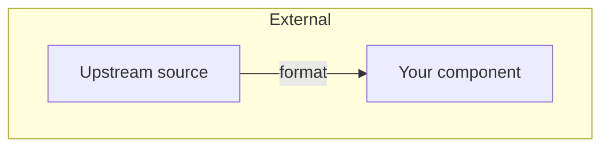
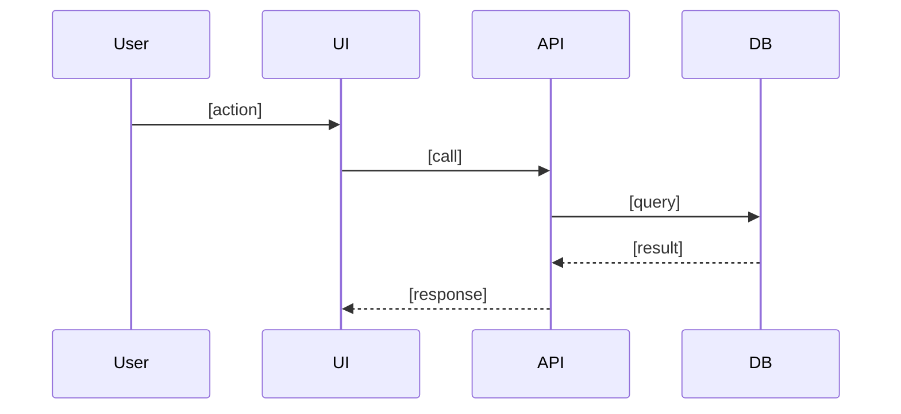

# Design: [Feature Name]

_Feature ID: [feature-slug] · Created: [YYYY-MM-DD]_

## Architecture overview



[1 paragraph narrating the diagram for a non-technical reader: what the boxes are, what the arrows mean, where data enters and leaves.]



[1 paragraph explaining the sequence to a non-technical reader.]

## Tech-stack choices

| Concern | Choice | Version | Reason |
|---|---|---|---|
| Language | | | |
| Framework | | | |
| Database | | | |
| Test runner | | | |

## Data model

### Entity: [Name]

| Field | Type | Constraints | Notes |
|---|---|---|---|
| id | | PK, NOT NULL | |
| | | | |

Relationships:
- [Entity] has many [Entity] via [column]

Migration path:
- [If existing schema, how this ships without downtime]

## API surface

### [METHOD] [/path]

**Purpose:** [one sentence]
**Auth:** [required / none / specific role]
**Request:**
```
{ ... }
```
**Response (200):**
```
{ ... }
```
**Errors:** [4xx/5xx cases]

## Key sequence flows

### [User action name]

```
1. User clicks X in UI
2. UI sends [METHOD] [/path] with [payload]
3. API validates [...]
4. API writes [...]
5. API returns [...]
6. UI renders [...]
```

## Rejected alternatives

Options considered and why they lost. Future readers will thank you.

| Option | Why rejected |
|---|---|
| | |

## Open questions deferred to Slice-Planner

- [Any implementation detail not decided here because it depends on slice order]

## Links

- Requirements: `specs/[feature]/requirements.md`
- Eval spec: `specs/[feature]/eval-spec.md`
- Slice plan: `specs/[feature]/slice-plan.md`
